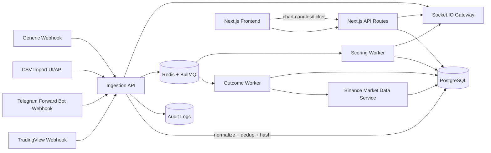

# Signal Intelligence Hub – Implementation Plan

## System Diagram

## DB Schema Summary

Core entities:
- `Source`: connector/source metadata and reliability metrics.
- `Signal`: immutable normalized signal record with required fields and payload hash.
- `SignalOutcome`: TP/SL/expired resolution with MFE/MAE/RR.
- `ConsensusSnapshot`: buy/sell weighted output per symbol/timeframe.
- `AuditLog`: connector changes, key changes, ingestion failures.
- `ConnectorCredential`: encrypted API credentials.
- `PriceCandle`: cached real candle data from Binance.
- `IngestionEvent`: delivery/retry status and dedup bookkeeping.

## Connector List + Implementation Notes

- TradingView Webhook (`/api/ingest/tradingview`) – **SUPPORTED**
  - API key or HMAC validation.
  - Parses JSON payload and stores raw immutable payload.
- Binance Market Data – **SUPPORTED**
  - REST klines + websocket miniTicker for real-time.
- Telegram Forward Connector (`/api/ingest/telegram`) – **SUPPORTED (compliant forward-only)**
  - Only forwarded/connected bot updates, no unauthorized scraping.
  - Regex parser for structured trade text.
- CSV Import (`/api/ingest/csv`) – **SUPPORTED**
  - Upload mapped rows and normalize.
- Generic Webhook (`/api/ingest/generic`) – **SUPPORTED**
  - User-brought machine payloads.
- Myfxbook AutoTrade – **PARTIAL**
  - Official/API-export driven only, no restricted scraping.
- Copy trading platforms without official API – **NOT_AVAILABLE**
  - Stubs with compliance reason.

## Scoring Formulas

### Source Credibility Score (0–100)

`score = tierWeight*0.30 + winRateAdj*0.20 + drawdownAdj*0.15 + consistency*0.10 + historyAdj*0.10 + avgRRAdj*0.10 + frequencyAdj*0.05`

- Tier weight: A=100, B=70, C=40.
- Win rate capped at 75% effective ceiling.
- Drawdown proxy from MAE percentile.
- Consistency = inverse of weekly variance in win rate.
- History length saturates at 180 days.

### Signal Confidence Score (0–100)

`confidence = completeness*0.20 + recencyDecay*0.15 + sourceCred*0.35 + spamPenalty*0.15 + conflictPenalty*0.15`

- Completeness full when entry/SL/TP all present.
- Recency half-life derived from timeframe.
- Spam/conflict penalties reduce confidence.

### Consensus

For symbol/timeframe window:

- `buyWeight = Σ(confidence_i * sourceCred_i where side=BUY)`
- `sellWeight = Σ(confidence_i * sourceCred_i where side=SELL)`
- `buyPct = buyWeight / (buyWeight + sellWeight)`
- Labels:
  - `INSUFFICIENT_DATA` if under minimum weighted count.
  - `BUY_BIAS` if buyPct >= 0.6.
  - `SELL_BIAS` if buyPct <= 0.4.
  - Else `MIXED`.

## Job Queue Plan

Queues (BullMQ):
- `ingestion-retry`: retries transient ingestion failures (exp backoff).
- `outcome-resolve`: resolves pending signals by candle checks.
- `score-recompute`: updates source credibility + signal confidence + consensus snapshots.
- `market-sync`: periodic candle sync jobs.

Operational controls:
- Per-connector rate limiting + circuit breaker state in Redis.
- Dedup key: `source:symbol:timeframe:side:bucket(5m)`.
- Structured logs and audit log writes for all failures/config changes.
